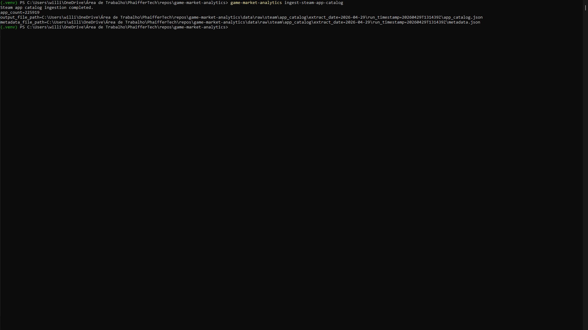
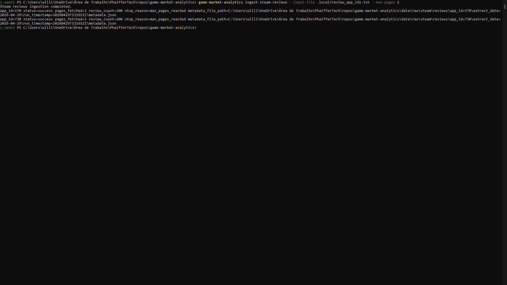
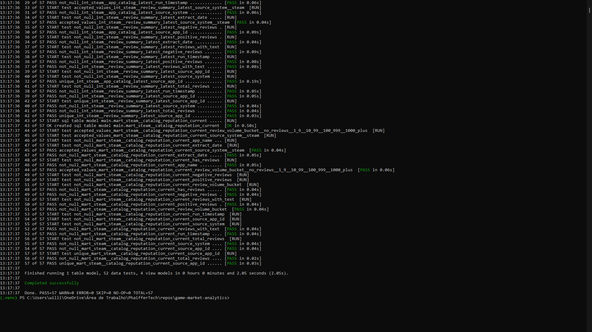
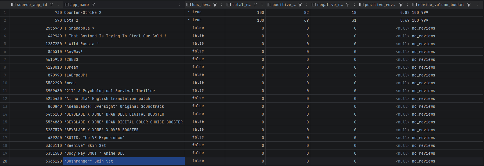
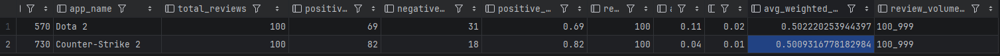
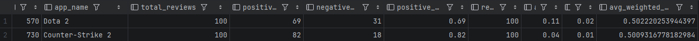

# Game Market Analytics

Local-first data engineering and analytics engineering project for Steam game market analysis.

This repository implements a Steam-only MVP that ingests real Steam data, lands raw source payloads, normalizes them into staged Parquet datasets, models them with dbt and DuckDB, and publishes a first business-facing catalog + reputation mart.

The project is intentionally portfolio-oriented: the implementation is small enough to inspect, but complete enough to show realistic ingestion, staging, modeling, testing, and analytical output.

## Project Overview

Game market data combines catalog metadata, product identity, player reviews, and reputation signals. This project focuses on the data engineering path from source APIs to an analytics-ready table that can answer questions such as:

- Which Steam apps are present in the current catalog?
- Which apps have controlled review coverage?
- How do review volume and positive review ratio compare across selected games?
- Which catalog records do not yet have review summary coverage?

The current validated review examples use Steam app IDs `570` and `730`.

## Current MVP Scope

Implemented now:

- Real Steam app catalog ingestion from the official Steam Web API.
- Controlled Steam reviews ingestion for explicit app IDs.
- Raw landing under `data/raw/`.
- Stage normalization to Parquet under `data/stage/`.
- dbt sources over staged Parquet.
- dbt staging models for catalog and reviews.
- dbt intermediate models for latest catalog records and latest review summaries.
- Final Steam-only mart: `mart_steam__catalog_reputation_current`.
- Local DuckDB execution through a repository-local profile.
- Unit tests for Python ingestion/staging utilities.
- dbt tests for staging, intermediate, and mart models.

Deferred for later phases:

- IGDB enrichment for genres, platforms, companies, publishers, and richer metadata.
- IsThereAnyDeal pricing and discount history.
- Historical trend marts and snapshots.
- Full-catalog review crawling.
- Dashboards, notebooks, orchestration, cloud deployment, and CI/CD.

## Implemented Pipeline

The current Steam-only pipeline has four main steps:

1. Ingest the Steam app catalog:

```powershell
game-market-analytics ingest-steam-app-catalog
```

2. Stage the app catalog to Parquet:

```powershell
game-market-analytics stage-steam-app-catalog
```

3. Ingest controlled Steam reviews:

```powershell
game-market-analytics ingest-steam-reviews --app-id 570 --app-id 730 --max-pages 1
```

4. Stage Steam reviews to Parquet:

```powershell
game-market-analytics stage-steam-reviews
```

Then build the dbt models:

```powershell
dbt build --project-dir dbt --profiles-dir dbt --select +mart_steam__catalog_reputation_current
```

## Data Layers

Raw landing:

```text
data/raw/steam/app_catalog/
data/raw/steam/reviews/
```

Staged Parquet:

```text
data/stage/steam/app_catalog/
data/stage/steam/reviews/
```

dbt staging:

- `stg_steam__app_catalog`
- `stg_steam__reviews`

dbt intermediate:

- `int_steam__app_catalog_latest`
- `int_steam__review_summary_latest`

dbt mart:

- `mart_steam__catalog_reputation_current`

## Final Analytical Output

`mart_steam__catalog_reputation_current` is the first business-facing table in the project.

Grain:

- One row per `source_app_id`.

Purpose:

- Represent the current Steam catalog enriched with the latest available review reputation summary.
- Preserve catalog records even when review coverage is not available yet.
- Provide portfolio-friendly metrics for catalog and reputation exploration.

Selected fields:

- `source_app_id`
- `source_system`
- `app_name`
- `item_type`
- `has_reviews`
- `total_reviews`
- `positive_reviews`
- `negative_reviews`
- `positive_review_ratio`
- `reviews_with_text`
- `avg_votes_up`
- `avg_votes_funny`
- `avg_weighted_vote_score`
- `latest_review_created_at`
- `latest_review_updated_at`
- `review_volume_bucket`

## Example Evidence / Screenshots

### Pipeline Execution Evidence

Steam app catalog ingestion:



Steam reviews ingestion:



dbt build for the catalog reputation mart:



### Analytical Output Evidence

Catalog reputation mart overview:



Dota 2 versus Counter-Strike 2 comparison:



Review metrics query:



## Local Setup

Typical Windows setup:

```powershell
python -m venv .venv
.\.venv\Scripts\Activate.ps1
python -m pip install -e ".[dev]"
game-market-analytics init-local
game-market-analytics validate-project
```

The Steam app catalog endpoint requires a Steam Web API key:

```powershell
$env:STEAM_API_KEY = "your-key-here"
$env:STEAM_API_KEY_AUTH_LOCATION = "query"
```

The repository-local DuckDB convention is:

```text
.local/game_market_analytics.duckdb
```

For the complete local workflow, see `docs/setup.md`.

## Current Limitations

- Review ingestion is controlled by explicit app IDs and is not a full-catalog review crawler.
- The current validated review examples cover app IDs `570` and `730`.
- Review summaries represent the latest staged snapshot available locally.
- The final mart is Steam-only and does not yet include genres, platforms, publishers, developers, pricing, or external enrichment.
- No dashboards or notebooks are included in the implemented MVP.

## Next Planned Phase

The next logical phase is enrichment and broader analytical modeling:

- Join the Steam-only mart to richer game metadata from IGDB.
- Add genre, platform, company, and release dimensions.
- Add pricing and discount history from IsThereAnyDeal.
- Build historical review/reputation trend models.
- Create lightweight portfolio presentation assets after the data model is stable.

## Repository Layout

```text
config/                     Source, entity, and metric definitions
data/                       Local raw, stage, and mart storage paths
dbt/                        dbt project for DuckDB transformations
docs/                       Project documentation and screenshots
src/game_market_analytics/  Python package for ingestion and staging
tests/                      Unit tests
```

## Local Workflow Shortcuts

```powershell
make setup
make init-local
make validate
make ingest-steam-app-catalog
make stage-steam-app-catalog
make ingest-steam-reviews
make stage-steam-reviews
make dbt-build
make test
make lint
```
